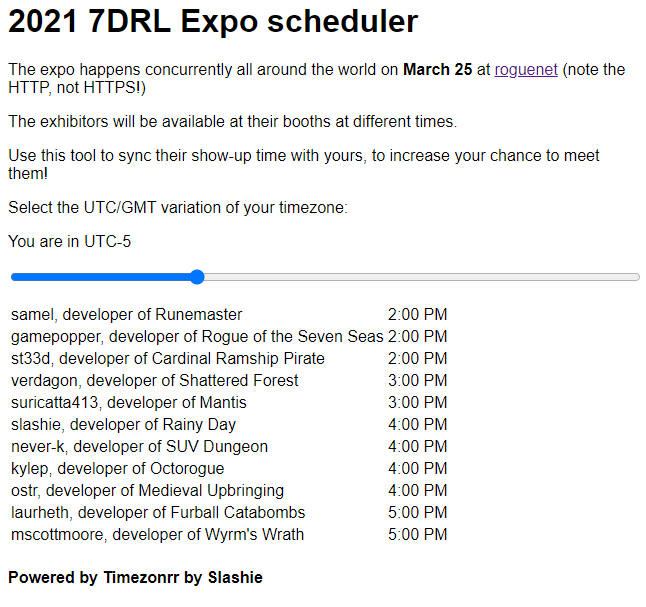

# What's this?
This simple script allows you create a page with a list of events, converting their local time to any UTC variation.

# How to use it
Modify index.html, adding the events you want to track including their local time and UTC variation.

# Samples

